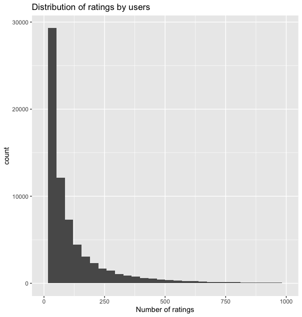
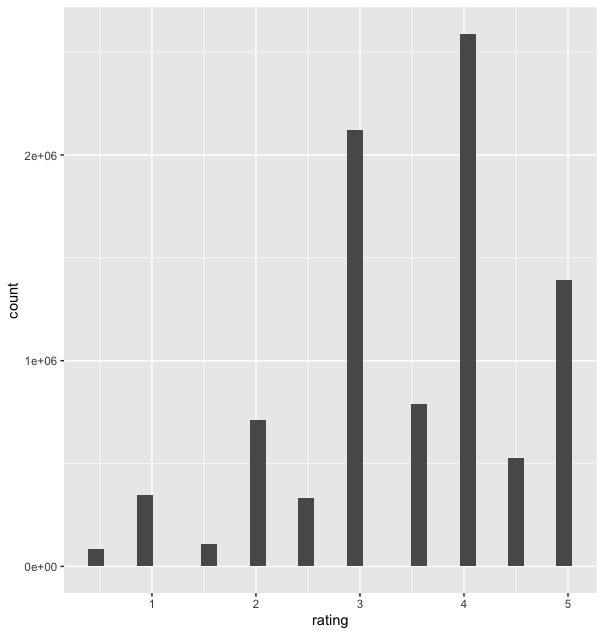
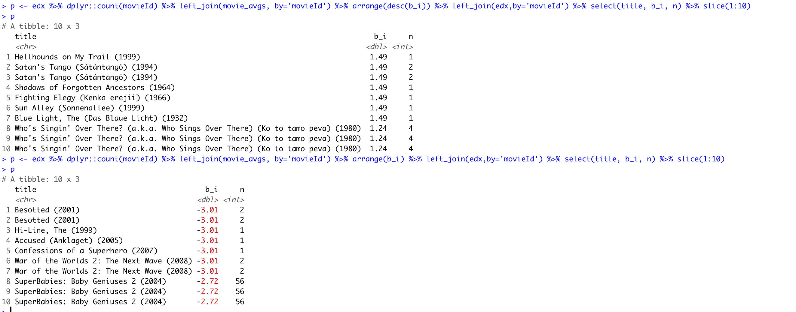

```{r setup, include=FALSE}
knitr::opts_chunk$set(echo = TRUE)
```

## Executive Summary

The goal of this project was to create a machine learning algorithm (model) for the prediction of movie ratings. We were provided with a dataset containing 10M records containing the movie ratings on a scale of 1-5 by different users. In addition to the movie ratings, the dataset also included movie title and movie genre. The dataset was split into training and validation sets. The training set was used to model different algorithms to develop a model. The accuracy of the model was calculated by running that model against the movies in the validation set to predict the ratings for those movies. RMSE was calculated for the predictions as a measure of the accuracy of the machine learning algorithm.


## Exploratory Data Analysis

The movieLens dataset was divided into a training set (edx) containing roughly 9M rows and a validation set (validation) containing roughly 1M rows. 


The initial exploration of the data revealed that, the ratings varied between 1-5 and included half-ratings. The dataset contained 69,878 distinct users and 10,677 distinct movies. This means that each user hasn't provided a rating for each movie. There was wide variability in number of ratings provided by different users as can be seen below



There was also wide variability in the overall ratings themselves. As you can see from the following plot, there were no instances of rating score of 0 and that the half-star ratings were generally less common than whole star ratings.



## Model Fitting Process:

### Model 1:
I started the analysis with a naive approach assuming that all the predictions in the validation set to be the mean of all ratings provided in the training set. 
With this naive approach the RMSE obtained was 1.06. So we needed to change the model for better predictions to reduce RMSE.

### Model 2:
In the second approach I considered movie to movie variation. Since some movies are better than the others it is reasonable to think that some movies were rated higher and some movies received lower ratings. The model that caprtures this variation was y = mu + b_i, where b_i was the movie to movie variation from the mean. 
With this approach, the RMSE went down to 0.944.

### Model 3:
In the third apprach, I considered user to user variation. Since some users generally provide lower ratings and some provide higher ratings, it is reasonable to expect user to user variation for the same movie rating. The model that captures the user variability was y - mu + b_i + b_u where b_i was movie to movie variability and b_u was user to user variability from the mean. 
With this approach the RMSE went down to 0.865

Now, with the model adjusted for user effect and movie effect, I looked at the top 10 best and the worst movies and the number of ratings received by each of them. The observed data is below.

### Number of Ratings for Top 10 and Worst 10 movies


As you can see, most of the top movies and bottom movies from the list received less than 5 ratings total. This suggests the predictions obtained from this sample size may not be accurate because the sample size is too small, in some cases only a single rating was received. In order to reduce the effect of small sample sizes and penalize the larger ratings with small sample sizes, I used regularization technique in the next model. 

### Model 4:
Finally,in the last appeach, I used regularization to penalize extreme ratings with small sample sizes. The penalty term lambda is more in cases where the movie received extreme scores from lesser number of ratings. In order to optimize the regularization parameter lamba, I used cross validation. In order to implement cross validation, I split the training data (edx) into training data used to train the model (edx_train) and cross validation data (edx_val). Once cross validation was performed on this dataset, a optimal value of lambda was obtained. Then this value of lamda was used on the fitted model to calculate the regularized estimated and the final predictions for the ratings. 
With this approach the RMSE went down to 0.86482


## Results: 
The results of above models are tabularized below

Model | RMSE
------|------
Naive approach(Estimate the avg)| 1.0612
Movie Effect Model | 0.94391
Movie + User Effect Model | 0.86535
Regularized Movie + User Effect Model | 0.86482

As you can see, the model that regularizes the movie ratings by penalizing extreme ratings with small sample size performed the best. The naive apprach which estimated all ratings to be the same as the overall average had the largest RMSE and the regularized model had the lest RMSE out of these models. The model that takes into account the movie and user variability tends to perform better than the naive approach, but it suffers from estimates being effected by smaller sample size for movies with extreme ratings. This drawback is later rectified by regularizing the estimates providing the best accuracy of all the models used in this excercise (0.86482)

## Conclusion: 
We can conclude from the above excercise that by implementing regularization technique as part of our estimation process, increased our overall accuracy of the prediction as can be seen by reduced RMSE when compared with other approaches. In addition to regularization, we used cross validation to optimize the model parameter lambda (penalty term) that was used to regularize the estimates.

a conclusion section that gives a brief summary of the report, its limitations and future work (the last two are recommended but not necessary)


